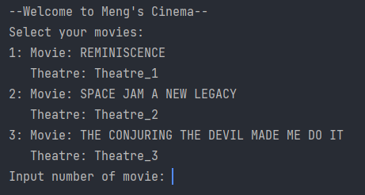
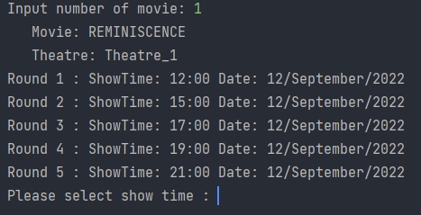
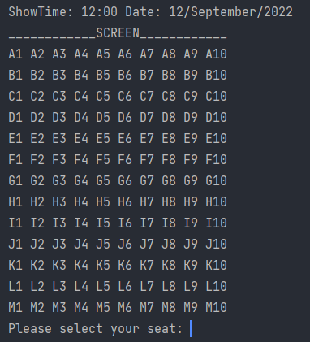

# Project #1 Data Structures and Algorithm Analysis
Name : Kontawat Wisetpaitoon  
Student ID : 6388154  
Section : 3 
# Project : Meng's Cinema
This program creates for Meng’s cinema so users can book tickets by themself. Meng’s cinema has 3 theaters, each theater screen 1 movie, each movie has 5 showtimes and each showtime has 130 seats.
In each booking, They can book more than one ticket. They need to select a movie, showtime, and seat. 
# How to use this program
1. You need to select movies that you need to book ticket.

2. After you select the movie, you need to select showtime

3. Select seat id.

4. After you select seat id, you can choose 2 way.
   1. Book another ticket (Loop to the method 1)
   2. Exit this program (Order Summary)
[]
